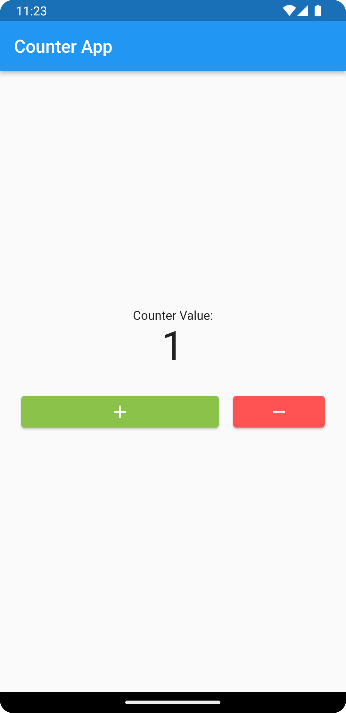
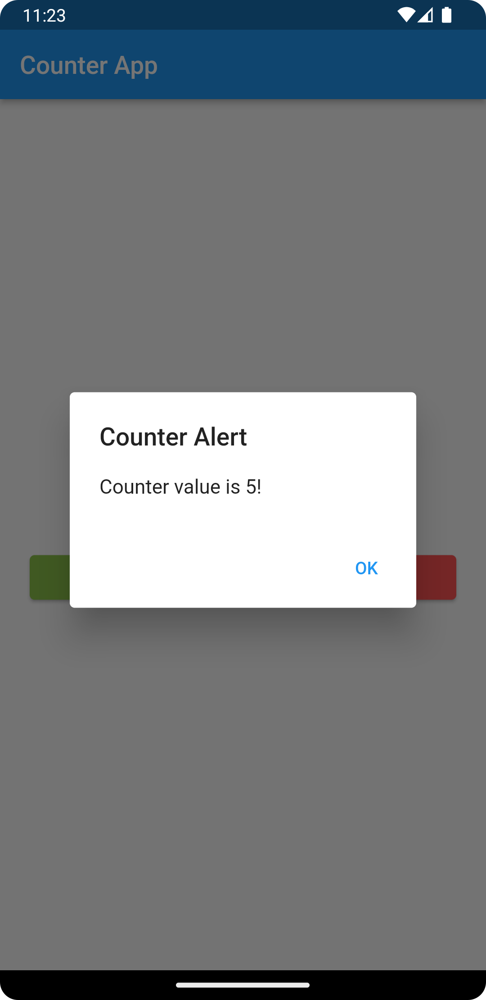

# module7_live_test

Question

•       Create a Flutter application that consists of a stateful widget called CounterApp. 

•       The CounterApp should display a counter value and two buttons: "Increment" and "Decrement".

•       Both buttons should be in a Row and have different sizes (responsive).

•       Press the "Increment" button to increase the counter value by 1 and press the "Decrement" button to decrease the counter value by 1. 

•       If the counter value reaches 5, display a dialog box with the message "Counter value is 5!".

•       If the counter value reaches 10, navigate to a new screen called SecondScreen that displays the message "Congratulations! You reached 10!".

 

Hint: 

Use the Expanded/Flexible widget and flex property for responsiveness and setting different sizes.

     
 
